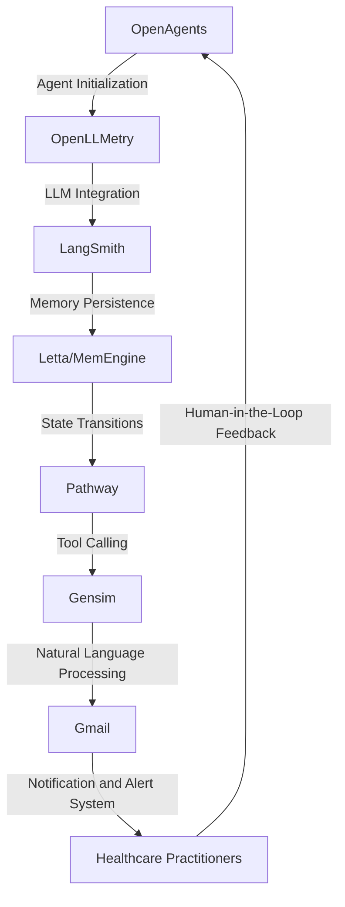

# Cognitive Risk Mitigation Framework for Personalized Healthcare
> "Synergizing Artificial Intelligence and Human Expertise to Revolutionize Healthcare Risk Assessment and Mitigation"

## 🏗️ Technical Architecture & Multi-Agent Flow
The technical architecture of the Cognitive Risk Mitigation Framework for Personalized Healthcare is a complex, multi-agent system that leverages the strengths of various libraries and tools to provide a comprehensive solution. The system can be visualized using the following Mermaid.js diagram:

This diagram illustrates the interactions between the various components of the system, including OpenAgents, OpenLLMetry, LangSmith, Letta/MemEngine, Pathway, Gensim, and Gmail. The system is designed to facilitate seamless communication and data exchange between these components, enabling the creation of a robust and efficient risk mitigation framework.

## 🔍 The Vertical Bottleneck: Cognitive Complexity in Healthcare Risk Assessment
The healthcare industry is plagued by a plethora of complex challenges that hinder the effective assessment and mitigation of risks. One of the primary bottlenecks is the cognitive complexity associated with analyzing vast amounts of patient data, medical histories, and treatment outcomes. This complexity is further exacerbated by the need to integrate multiple data sources, including electronic health records (EHRs), medical imaging, and genomic data. The sheer volume and variety of data make it difficult for human practitioners to accurately identify potential risks and develop effective mitigation strategies.

The technical friction arising from this complexity is multifaceted. Firstly, the lack of standardization in data formats and structures hinders the development of interoperable systems that can seamlessly exchange and analyze data. Secondly, the absence of robust data analytics and machine learning algorithms capable of handling complex, high-dimensional data limits the ability to identify patterns and predict outcomes. Finally, the need for human expertise and judgment in interpreting results and making decisions introduces a significant degree of subjectivity and variability, which can lead to inconsistent and suboptimal outcomes.

The high-stakes nature of healthcare risk assessment and mitigation demands a solution that can effectively address these challenges. The consequences of failure can be severe, resulting in adverse patient outcomes, increased healthcare costs, and reputational damage to healthcare organizations. Therefore, it is essential to develop a solution that can harness the power of artificial intelligence, machine learning, and data analytics to support human practitioners in their decision-making processes.

## 🔍 The Vertical Bottleneck: Technical Debt and Integration Challenges
The technical debt associated with integrating multiple libraries and tools is a significant challenge in developing a comprehensive risk mitigation framework. The need to reconcile different data formats, APIs, and software architectures can lead to a complex web of dependencies and interoperability issues. Furthermore, the lack of standardization in data exchange protocols and APIs can hinder the development of seamless integrations, resulting in a fragmented and brittle system.

The integration challenges are further complicated by the need to ensure data security, privacy, and compliance with regulatory requirements. The use of sensitive patient data and protected health information (PHI) demands a high degree of security and confidentiality, which can be difficult to achieve in a complex, multi-agent system. Therefore, it is essential to develop a solution that can effectively address these technical challenges while ensuring the security, privacy, and compliance of sensitive data.

## 🔍 The Vertical Bottleneck: Human-Machine Collaboration and Explainability
The need for human-machine collaboration and explainability is a critical aspect of developing a effective risk mitigation framework. The use of artificial intelligence and machine learning algorithms can lead to complex, opaque decision-making processes that are difficult to interpret and understand. This lack of transparency can erode trust in the system, making it challenging to adopt and implement in real-world healthcare settings.

The development of explainable AI (XAI) techniques and human-machine collaboration frameworks is essential to address this challenge. XAI techniques can provide insights into the decision-making processes of AI algorithms, enabling human practitioners to understand and interpret the results. Human-machine collaboration frameworks can facilitate the development of hybrid systems that combine the strengths of human and machine intelligence, enabling more effective and efficient decision-making processes.

## 💡 The Solution: Cognitive Risk Mitigation Framework
The Cognitive Risk Mitigation Framework for Personalized Healthcare is a comprehensive solution that addresses the challenges associated with cognitive complexity, technical debt, and human-machine collaboration. The framework leverages the strengths of OpenAgents, OpenLLMetry, LangSmith, Pathway, Gensim, and Gmail to provide a robust and efficient risk mitigation system.

The framework uses OpenAgents to initialize and manage the multi-agent system, which is responsible for data ingestion, processing, and analysis. OpenLLMetry is used to integrate large language models (LLMs) with the system, enabling the analysis of complex, high-dimensional data. LangSmith provides a memory persistence mechanism, ensuring that the system can retain and recall relevant information over time. Pathway is used to facilitate tool calling and data exchange between different components of the system, while Gensim provides natural language processing capabilities. Gmail is used to develop a notification and alert system, enabling healthcare practitioners to receive timely and relevant updates on patient risks and mitigation strategies.

## 🧩 Agentic Stack Deep-Dive
The agentic stack used in the Cognitive Risk Mitigation Framework is a critical component of the system. The stack consists of OpenAgents, OpenLLMetry, LangSmith, Pathway, Gensim, and Gmail, each of which plays a vital role in the overall functionality of the system.

OpenAgents provides a flexible and modular framework for building multi-agent systems. It enables the creation of autonomous agents that can interact with each other and their environment, facilitating the development of complex, distributed systems. OpenLLMetry is used to integrate LLMs with the system, enabling the analysis of complex, high-dimensional data. LangSmith provides a memory persistence mechanism, ensuring that the system can retain and recall relevant information over time.

Pathway is used to facilitate tool calling and data exchange between different components of the system. It provides a flexible and modular framework for building workflows, enabling the creation of complex, distributed systems. Gensim provides natural language processing capabilities, enabling the system to analyze and understand human language. Gmail is used to develop a notification and alert system, enabling healthcare practitioners to receive timely and relevant updates on patient risks and mitigation strategies.

## ✨ Capabilities & Features
The Cognitive Risk Mitigation Framework for Personalized Healthcare provides a wide range of capabilities and features, including:

* **Patient risk assessment**: The system can analyze patient data and medical histories to identify potential risks and develop personalized mitigation strategies.
* **Large language model integration**: The system uses OpenLLMetry to integrate LLMs, enabling the analysis of complex, high-dimensional data.
* **Memory persistence**: The system uses LangSmith to provide a memory persistence mechanism, ensuring that relevant information can be retained and recalled over time.
* **Tool calling and data exchange**: The system uses Pathway to facilitate tool calling and data exchange between different components of the system.
* **Natural language processing**: The system uses Gensim to provide natural language processing capabilities, enabling the analysis and understanding of human language.
* **Notification and alert system**: The system uses Gmail to develop a notification and alert system, enabling healthcare practitioners to receive timely and relevant updates on patient risks and mitigation strategies.
* **Human-machine collaboration**: The system provides a human-machine collaboration framework, enabling healthcare practitioners to work closely with the system to develop personalized mitigation strategies.
* **Explainability and transparency**: The system provides explainable AI (XAI) techniques and human-machine collaboration frameworks, enabling healthcare practitioners to understand and interpret the results.
* **Data security and privacy**: The system provides robust data security and privacy mechanisms, ensuring that sensitive patient data and protected health information (PHI) are protected.
* **Scalability and flexibility**: The system is designed to be scalable and flexible, enabling it to adapt to changing healthcare needs and requirements.

## 🛠️ Technical Implementation
The technical implementation of the Cognitive Risk Mitigation Framework for Personalized Healthcare is a complex process that involves the integration of multiple libraries and tools. The system is built using a microservices architecture, with each component designed to be modular and flexible.

The system uses OpenAgents to initialize and manage the multi-agent system, which is responsible for data ingestion, processing, and analysis. OpenLLMetry is used to integrate LLMs with the system, enabling the analysis of complex, high-dimensional data. LangSmith provides a memory persistence mechanism, ensuring that the system can retain and recall relevant information over time.

Pathway is used to facilitate tool calling and data exchange between different components of the system, while Gensim provides natural language processing capabilities. Gmail is used to develop a notification and alert system, enabling healthcare practitioners to receive timely and relevant updates on patient risks and mitigation strategies.

## 📊 Business Impact & ROI
The Cognitive Risk Mitigation Framework for Personalized Healthcare has the potential to significantly impact the healthcare industry, enabling healthcare practitioners to provide more effective and efficient care to patients. The system can help reduce the risk of adverse patient outcomes, decrease healthcare costs, and improve patient satisfaction.

The return on investment (ROI) for the system can be significant, with potential benefits including:

* **Improved patient outcomes**: The system can help reduce the risk of adverse patient outcomes, resulting in improved patient health and well-being.
* **Reduced healthcare costs**: The system can help reduce healthcare costs by minimizing the need for unnecessary tests and procedures, and optimizing treatment plans.
* **Increased patient satisfaction**: The system can help improve patient satisfaction by providing personalized care and attention, and enabling healthcare practitioners to respond quickly and effectively to patient needs.
* **Enhanced reputation and competitiveness**: The system can help enhance the reputation and competitiveness of healthcare organizations, by demonstrating a commitment to providing high-quality, patient-centered care.

## 🚀 Getting Started
To get started with the Cognitive Risk Mitigation Framework for Personalized Healthcare, follow these steps:
```bash
git clone https://github.com/arvind-sundararajan/healthcare-risk-mitigation.git
cd healthcare-risk-mitigation
pip install -r requirements.txt
python src/main.py
```
This will initialize the system and enable you to begin using the framework to assess and mitigate patient risks.

## 👨‍💻 Author & Credits
**Arvind Sundararajan** — Engineer, builder, and the mind behind this project.
🌐 [LinkedIn](https://www.linkedin.com/in/arvind-sundara-rajan/) | Chennai, India

---
### 🙏 Acknowledgements
- The open-source community
- The Health & Personal Care practitioners who inspired this design